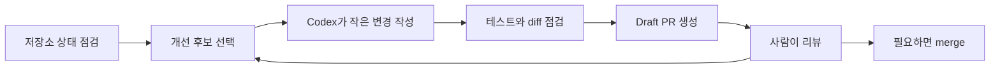

# repo-health-bot

`repo-health-bot`은 저장소를 빠르게 훑어서 기본 건강 상태를 Markdown 또는 JSON으로 보여주는 작은 Python CLI입니다. 동시에 Codex가 작은 개선점을 찾아 PR로 올리는 자가 개선 루프를 실험하기 위한 seed 프로젝트입니다.

## 무엇을 할 수 있나요?

- 저장소 안의 파일 수, 텍스트 파일 수, 전체 라인 수를 집계합니다.
- `README.md`, `pyproject.toml`, `package.json`, `go.mod`, `Cargo.toml`, `LICENSE` 같은 주요 메타데이터 파일을 감지합니다.
- 텍스트 파일에서 `TODO`와 `FIXME` 위치를 찾아 보여줍니다.
- 사람이 읽기 쉬운 Markdown 리포트와 자동화에 쓰기 좋은 JSON 리포트를 출력합니다.
- Codex self-improvement runner가 반복적으로 개선 후보를 고르고, 작은 브랜치와 PR을 만들 수 있는 실험 대상으로 쓰입니다.

## 빠른 시작

Python 3.10 이상이 필요합니다.

```bash
python -m pip install -e .
python repo_health_bot.py .
```

JSON으로 받고 싶다면 `--json`을 붙입니다.

```bash
python repo_health_bot.py . --json
```

설치 후 콘솔 명령으로도 실행할 수 있습니다.

```bash
repo-health-bot .
repo-health-bot . --json
```

다른 저장소를 점검하려면 경로만 바꾸면 됩니다.

```bash
git clone https://github.com/OWNER/REPO.git checked-repo
python repo_health_bot.py checked-repo
```

## 출력 예시

```text
# Repository Health Report

- Root: `/path/to/repo`
- Files: 41
- Text files: 17
- Lines: 1240
- Metadata files: README.md, LICENSE
- TODO/FIXME hits: 0
```

항목의 의미는 다음과 같습니다.

- `Files`: ignore 대상과 캐시 폴더를 제외한 전체 파일 수입니다.
- `Text files`: repo-health-bot이 텍스트로 읽은 파일 수입니다.
- `Lines`: 읽은 텍스트 파일의 총 라인 수입니다.
- `Metadata files`: 프로젝트 설명, 패키지 설정, 라이선스 같은 운영 메타데이터입니다.
- `TODO/FIXME hits`: 나중에 정리해야 할 주석 후보입니다.

## 자가 개선 루프란?

이 프로젝트에서 말하는 자가 개선은 AI가 `main`에 직접 push하거나 자동 merge하는 방식이 아닙니다. Codex가 작은 개선 후보를 고르고, 별도 브랜치에서 수정하고, 검증을 통과하면 사람이 리뷰할 수 있는 draft PR을 만드는 방식입니다.



기본 운영 원칙은 단순합니다.

- 한 번에 하나의 작은 개선만 진행합니다.
- 테스트와 `git diff --check`를 통과해야 합니다.
- 생성된 PR은 draft로 시작합니다.
- 비밀값, 인증, 결제, 배포 인프라 같은 고위험 영역은 자동 개선 대상에서 제외합니다.
- 최종 merge 여부는 사람이 결정합니다.

## 로컬에서 자가 개선 실험을 돌리는 방법

이 저장소에는 Codex self-improvement runner가 사용할 최소 검증 스크립트가 들어 있습니다.

```powershell
.\.codex\self-improve\run-checks.ps1
```

로컬 Codex App 인증 상태를 활용한 주기 실행은 이 저장소 바깥의 self-improve kit에서 관리합니다. runner는 보통 다음 순서로 동작합니다.

1. `repo-health-bot` 저장소의 최신 상태를 확인합니다.
2. 개선 후보를 고릅니다. 예: README 보강, CLI 입력 검증, 테스트 추가.
3. 별도 worktree와 브랜치를 만듭니다.
4. Codex에 구현, 리뷰, 테스트 프롬프트를 순차적으로 실행합니다.
5. 검증이 통과하면 draft PR을 생성합니다.

자세한 운영 방법은 [자가 개선 루프 가이드](docs/SELF_IMPROVEMENT_LOOP.md)를 참고하세요.

## 문서

- [사용법 가이드](docs/USAGE.md): 설치, 실행, 출력 해석, 다른 repo 점검 방법
- [자가 개선 루프 가이드](docs/SELF_IMPROVEMENT_LOOP.md): 주기 실행 구조와 안전한 운영 원칙

## 개발자용 검증

```bash
python -m unittest discover -s tests
python repo_health_bot.py .
python repo_health_bot.py . --json
```

Windows PowerShell에서는 다음 명령으로 같은 검증을 실행할 수 있습니다.

```powershell
.\.codex\self-improve\run-checks.ps1
```

## 현재 한계와 좋은 개선 후보

- PowerShell 프로젝트를 더 잘 보기 위해 `.ps1`, `.psm1`, `.psd1` 텍스트 스캔을 추가할 수 있습니다.
- `SECURITY.md`, `SUPPORT.md`, `CHANGELOG.md`, `.env.example`, `.github/workflows/*.yml` 같은 운영 메타데이터 감지를 넓힐 수 있습니다.
- TODO/FIXME 검색을 단순 부분 문자열이 아니라 단어 단위로 정교화할 수 있습니다.
- ignore 패턴을 CLI 옵션으로 받을 수 있습니다.

## Level 3 자동 merge 실험

이 저장소는 테스트용으로 Level 3 자가 개선 루프를 실험합니다. Codex가 만든 PR은 `CI`, `Auto Merge Guard`, `Redteam Review`를 통과해야 자동 merge 후보가 됩니다.

Level 3에서도 다음 안전장치는 유지합니다.

- `main` 직접 push 대신 PR 기반으로 동작합니다.
- `Redteam Review` check가 승인해야 합니다.
- `policies/auto_merge.json`의 파일 수, diff 크기, 금지 경로 정책을 통과해야 합니다.
- `.github/workflows/**`, redteam/guard 스크립트, auto-merge 정책 자체를 바꾸는 PR은 자동 merge하지 않고 수동 검토 대상으로 남깁니다.
- secret 파일이나 credential로 보이는 변경은 redteam에서 차단합니다.

자동 merge workflow는 GitHub Actions 권한으로 `gh pr merge --squash --delete-branch`를 실행합니다. 저장소 설정에서 Actions의 write 권한과 pull request write 권한이 허용되어 있어야 실제 merge까지 진행됩니다.
