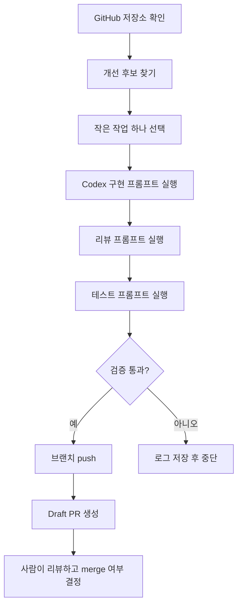

# 자가 개선 루프 가이드

`repo-health-bot`의 자가 개선 루프는 AI가 저장소를 마음대로 바꾸는 자동화가 아닙니다. Codex가 작은 개선 후보를 고르고, 별도 브랜치에서 작업하고, 검증을 통과한 변경만 draft PR로 올리는 구조입니다.

## 전체 흐름



## 왜 PR 방식으로 운영하나요?

자가 개선은 실패할 수 있습니다. 그래서 `main`을 직접 바꾸지 않고, 작은 PR로 결과를 남깁니다.

이 방식의 장점은 다음과 같습니다.

- 어떤 변경을 했는지 diff로 볼 수 있습니다.
- GitHub Actions와 로컬 테스트로 기본 품질을 확인할 수 있습니다.
- 잘못된 변경은 merge하지 않으면 됩니다.
- 실패 로그와 PR 기록이 남아서 다음 개선 후보를 고르기 쉽습니다.

## 한 번의 루프에서 하는 일

1. 저장소 상태를 확인합니다.
2. 개선 후보를 하나 고릅니다.
3. 별도 worktree와 브랜치를 만듭니다.
4. Codex가 코드를 고치거나 문서를 보강합니다.
5. `.\.codex\self-improve\run-checks.ps1` 또는 동등한 검증을 실행합니다.
6. 변경 파일 수와 diff 범위가 과도하지 않은지 확인합니다.
7. draft PR을 생성합니다.

## 좋은 개선 후보

처음에는 위험이 낮고 검증이 쉬운 작업이 좋습니다.

- README 예시 보강
- CLI 오류 메시지 개선
- JSON 출력 테스트 추가
- 누락된 텍스트 확장자 지원
- 메타데이터 파일 감지 범위 확대
- TODO/FIXME 검색 정확도 개선

반대로 다음 작업은 자동 루프의 기본 대상에서 제외하는 편이 안전합니다.

- 비밀값, 인증, 결제, 배포 설정 변경
- 대규모 리팩터링
- 의존성 대량 추가
- 테스트를 약화하거나 삭제하는 변경
- 자동 merge

## 로컬 Codex App 루프와의 관계

이 저장소는 실험 대상 repo입니다. 주기 실행 자체는 보통 별도 self-improve kit 또는 Windows 작업 스케줄러에서 관리합니다.

로컬 runner는 다음 값을 기본값으로 받을 수 있습니다.

- 대상 repo: `overtura/repo-health-bot`
- 모델: `gpt-5.5`
- reasoning effort: `xhigh`
- service tier: `fast`
- PR 상태: draft
- 언어: 한국어

runner는 이 저장소의 `.codex/self-improve/run-checks.ps1`을 검증 명령으로 사용할 수 있습니다.

## PR을 확인하는 방법

자가 개선 루프가 PR을 만들면 GitHub의 Pull requests 탭에서 확인합니다.

GitHub CLI로는 다음처럼 볼 수 있습니다.

```bash
gh -R overtura/repo-health-bot pr list --state open
```

특정 PR의 체크 상태는 다음처럼 확인합니다.

```bash
gh -R overtura/repo-health-bot pr checks PR_NUMBER
```

## 운영 규칙

- 한 번에 하나의 작은 개선만 올립니다.
- PR 제목과 본문은 한국어로 작성합니다.
- 생성된 PR은 draft로 시작합니다.
- 검증 실패 시 PR을 만들지 않거나, 실패 사실을 명확히 남깁니다.
- 사람이 리뷰한 뒤 merge합니다.

## Level 3 자동 merge 모드

테스트 repo에서는 Level 3 자동 merge 모드를 사용할 수 있습니다. 이 모드에서는 PR을 사람이 직접 merge하지 않아도, 아래 조건을 모두 만족하면 GitHub Actions가 squash merge를 시도합니다.

1. `CI / test` check가 성공합니다.
2. `Redteam Review / redteam-review` check가 성공합니다.
3. `scripts/auto_merge_guard.py`가 hard failure를 찾지 않습니다.
4. guard 결과의 `auto_merge_allowed`가 `true`입니다.
5. PR의 GitHub `mergeStateStatus`가 `CLEAN`입니다.

Level 3 gate는 다음 순서로 평가됩니다.

1. `Redteam Review` workflow가 PR diff에 대해 `scripts/auto_merge_guard.py`를 실행합니다.
2. guard는 `policies/auto_merge.json`을 읽어 base branch, head branch prefix, 변경 파일 수, 추가/삭제 라인 수, binary 변경, 금지 경로, 수동 검토 경로를 검사합니다.
3. guard의 `hard_failures`가 있으면 정책 평가가 실패합니다. `manual_reasons`가 있으면 guard 자체는 실행되지만 `auto_merge_allowed`가 `false`가 되어 자동 merge 대상에서 빠집니다.
4. `scripts/redteam_review.py`가 guard 결과와 diff를 다시 보고 `Redteam Review / redteam-review` check를 만듭니다.
5. `Auto Merge` workflow가 `CI` 또는 `Redteam Review` 완료 이벤트에서 다시 PR 상태를 읽고 guard를 재실행한 뒤, `scripts/merge_decision.py`에 `test`와 `redteam-review`를 필수 check로 넘깁니다.
6. `merge_decision.py`가 필수 check 성공, guard의 `passed`와 `auto_merge_allowed`, `mergeStateStatus == CLEAN`을 모두 만족할 때만 `should_merge: true`를 냅니다.

Level 3 정책은 넓은 코드 변경을 허용하지만, 자동 merge 시스템 자체를 바꾸는 변경은 자동으로 merge하지 않습니다. 다음 경로는 redteam과 CI를 통과해도 수동 검토 대상으로 분류됩니다.

- `.github/workflows/**`
- `policies/auto_merge.json`
- `scripts/auto_merge_guard.py`
- `scripts/redteam_review.py`
- `scripts/merge_decision.py`

즉, 일반 기능/문서/테스트 개선은 자동 merge 실험 대상이지만, 자동 merge 장치를 약화하거나 우회할 수 있는 변경은 사람이 확인해야 합니다.

자동 merge가 실제로 동작하는지 확인할 때는 `docs/**`처럼 허용된 경로의 작은 PR을 사용합니다. CI와 redteam이 모두 통과하면 `Auto Merge` workflow가 PR을 squash merge합니다.
